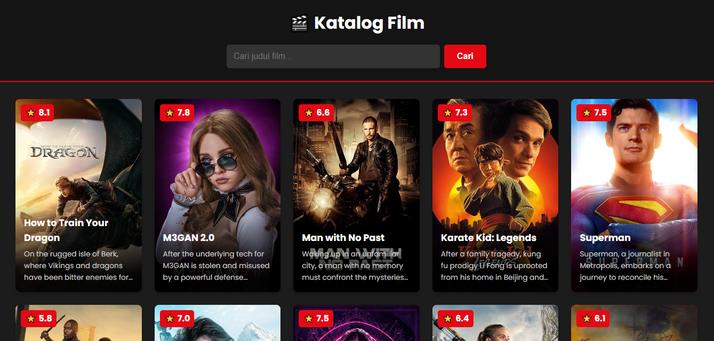

# 🎬 Aplikasi Katalog Film

Sebuah aplikasi web sederhana untuk menjelajahi film-film populer dan melakukan pencarian menggunakan The Movie Database (TMDb) API. Proyek ini dibuat untuk mendemonstrasikan kemampuan pengembangan frontend dengan HTML, CSS, dan JavaScript murni.




---

## Deskripsi

Aplikasi ini memungkinkan pengguna untuk melihat daftar film yang sedang populer saat ini. Selain itu, terdapat fitur pencarian yang kuat untuk menemukan film berdasarkan judul. Tampilan aplikasi dirancang agar responsif dan terlihat bagus di berbagai perangkat, mulai dari desktop hingga mobile. Proyek ini dibangun tanpa menggunakan framework JavaScript eksternal untuk menonjolkan pemahaman fundamental tentang teknologi web.

---

## Fitur Utama

-   ✅ **Tampilan Film Populer:** Secara otomatis menampilkan daftar film terpopuler saat halaman dimuat.
-   ✅ **Pencarian Real-time:** Mencari film secara dinamis berdasarkan input pengguna.
-   ✅ **Desain Responsif:** Layout yang dapat beradaptasi dengan baik di layar desktop, tablet, dan mobile.
-   ✅ **Penanganan Error:** Memberikan umpan balik kepada pengguna jika film tidak ditemukan atau terjadi kesalahan jaringan.
-   ✅ **Tampilan Detail:** Menampilkan poster, judul, rating, dan deskripsi singkat untuk setiap film.

---

## Teknologi yang Digunakan

-   **HTML5**
-   **CSS3** (Flexbox, Grid, Variabel)
-   **JavaScript (ES6+)** (Vanilla JS, Async/Await, Fetch API)
-   **[The Movie Database (TMDb) API](https://www.themoviedb.org/)** sebagai sumber data.

---

## Cara Menjalankan Secara Lokal

Untuk menjalankan proyek ini di komputer Anda, ikuti langkah-langkah berikut:

1.  **Clone repositori ini:**
    ```bash
    git clone [https://github.com/](https://github.com/)Hmzy12/movie-catalog-app.git
    ```

2.  **Masuk ke direktori proyek:**
    ```bash
    cd movie-catalog-app
    ```

3.  **Buat file `js/config.js`:**
    Buat file baru di dalam folder `js` dengan nama `config.js` dan isikan API key Anda.
    ```javascript
    // js/config.js
    const apiKey = 'MASUKKAN_API_KEY_TMDb_ANDA_DISINI';
    ```

4.  **Buka `index.html`:**
    Buka file `index.html` di browser favorit Anda.